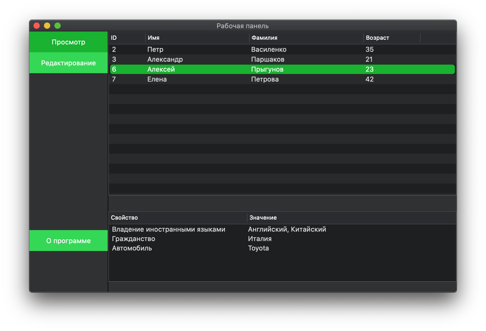
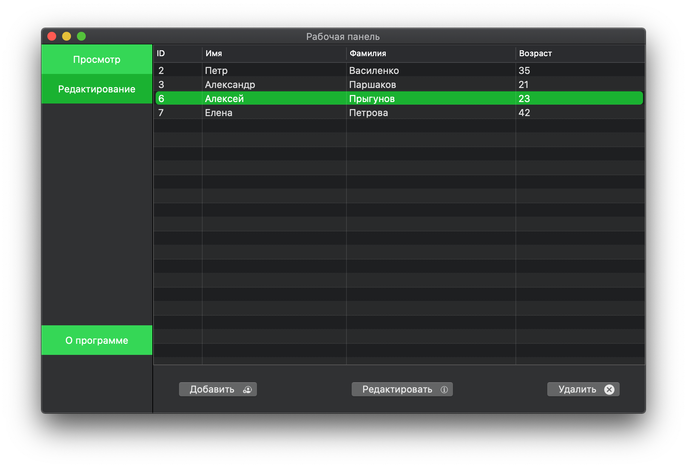
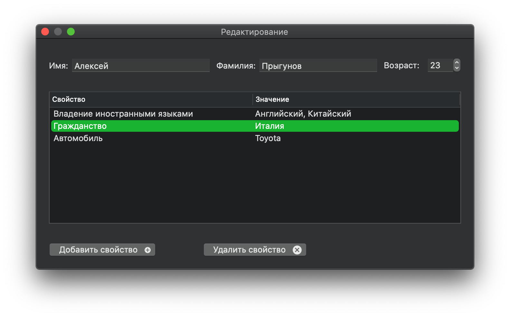

# MacOS People Data Storage

## Вкладка "Просмотр данных"
Данные просматриваются во вкладке "Просмотр". Нажатие на строку таблицы показывает произвольные свойства, добавленные для конкретного человека. Двойной клик совершает переход во вкладку редактирования, где можно перейти к окну редактирования выбранного человека.
 
## Вкладка "Редактирование данных"
Данные добавляются, редактируются и удаляются во вкладке "Редактирование":
 

Двукратное нажатие на нужный объект позволяет перейти к окну редактирования данных для конкретного человека: 
 

## Вкладка "О программе"
 