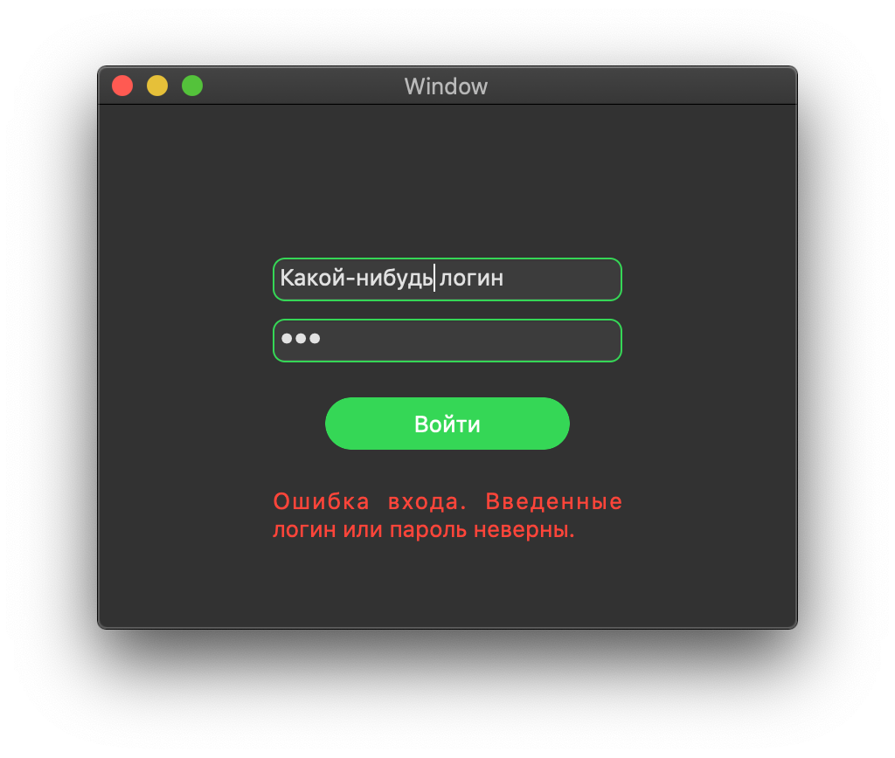

# MacOS People Data Storage

## Вход в приложение
Для входа используется заранее подготовленные логин и пароль. Для имитации проверки данных используется таймер. Во время проверки отображается прогресс-бар. Если данные не прошли проверку, появляется соответствующее сообщение. Если прошли - происходит переходит к рабочей панели.
 

## Вкладка "Просмотр данных"
Данные просматриваются во вкладке "Просмотр". Нажатие на строку таблицы показывает произвольные свойства, добавленные для конкретного человека. Двойной клик совершает переход во вкладку редактирования, где можно перейти к окну редактирования выбранного человека.
 

## Вкладка "Редактирование данных"
Данные добавляются, редактируются и удаляются во вкладке "Редактирование":
 

Двойное нажатие на строку или выбор строки в таблице и последующее нажатие кнопки "Редактировать" позволяют перейти к окну редактирования данных для конкретного человека: 
 

## Вкладка "О программе"
 